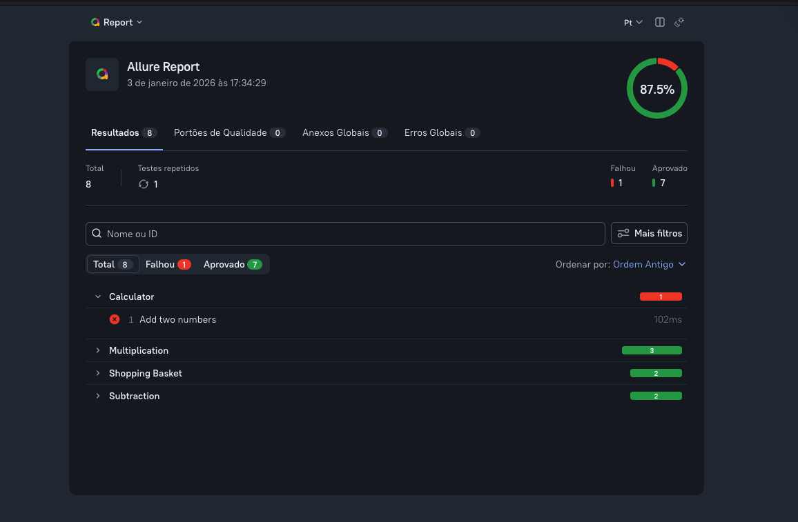

# 📊 Allure Report no Reqnroll

Este guia explica como executar testes e gerar relatórios HTML com o Allure Report no projeto Reqnroll/xUnit.

## 📋 Índice
- [O que é Allure Report?](#o-que-é-allure-report)
- [Pré-requisitos](#pré-requisitos)
- [Executando Testes](#executando-testes)
- [Gerando Relatórios](#gerando-relatórios)
- [Visualizando Relatórios](#visualizando-relatórios)
- [Fluxo Completo](#fluxo-completo)
- [Troubleshooting](#troubleshooting)
- [Referências](#referências)

---

## 🎯 O que é Allure Report?

O Allure Report é uma ferramenta de geração de relatórios de testes que cria documentação HTML interativa e rica em detalhes.

### 📸 Exemplo de Relatório Gerado



### Com ele você pode:

- ✅ Visualizar resultados de testes de forma clara e organizada
- 📊 Ver estatísticas detalhadas (passed, failed, duration)
- 🔍 Analisar histórico de execuções
- 📝 Agrupar testes por features, stories, tags
- 🖼️ Incluir screenshots e anexos
- ⏱️ Acompanhar performance e tendências

### Por que usar Allure com Reqnroll?

- **Integração BDD**: Suporta cenários Gherkin nativamente
- **Detalhamento de Steps**: Cada step do cenário é rastreado
- **Rastreabilidade**: Tags viram labels organizadas no relatório
- **Visualização Rica**: Interface moderna e interativa

---

## 📦 Pré-requisitos

### Já Instalados no Projeto ✅
- ✅ **Allure.Net.Commons** v2.14.1 (pacote NuGet)
- ✅ **Allure CLI** v3.0.0 (pacote npm)
- ✅ **Hooks de integração** configurados

### Você Precisa Ter
- **Node.js** 18+ e npm (para executar o Allure CLI)
- **.NET 8.0 SDK** (para executar os testes)
- Navegador web (para visualizar relatórios)

### Verificar Instalação
```bash
# Verificar Node.js
node --version  # Deve ser 18+

# Verificar .NET
dotnet --version  # Deve ser 8.0+

# Verificar Allure CLI
npx allure --version  # Deve ser 3.0.0+
```

---

## 🧪 Executando Testes

### Comando Básico
```bash
dotnet test Calculator.Test.csproj
```

### O que Acontece?
1. Os testes Reqnroll/xUnit são executados
2. Os **Hooks** integrados capturam informações de cada cenário e step
3. Arquivos JSON são gerados no diretório `allure-results/`
4. Cada arquivo contém dados estruturados sobre a execução

### Onde os Resultados São Salvos?
```
allure-results/
├── <uuid>-result.json       # Resultado de cada teste
├── <uuid>-container.json    # Agrupamento (features, suites)
└── <uuid>-attachment.*      # Screenshots, logs (se houver)
```

### Verificar Sucesso
```bash
# Ver conteúdo do diretório
ls -la allure-results/

# Deve conter arquivos .json
# Tamanho aproximado: 50-100KB por cenário
```

---

## 📈 Gerando Relatórios

### ⚠️ Comando Correto (Allure CLI v3)

```bash
# ✅ SINTAXE CORRETA
npx allure generate -o allure-report
```

**Importante**: O Allure CLI v3 **busca automaticamente** o diretório `allure-results/`.

### ❌ Não Use Sintaxes Antigas
```bash
# ❌ NÃO FUNCIONA no Allure CLI v3
npx allure generate allure-results --clean -o allure-report
```

### O que Acontece?
1. O Allure CLI lê os arquivos JSON em `allure-results/`
2. Processa os dados e gera assets HTML/CSS/JS
3. Cria o diretório `allure-report/` com o site estático
4. Arquivo principal: `allure-report/index.html`

### Estrutura do Relatório Gerado
```
allure-report/
├── index.html          # Página principal
├── app.js              # JavaScript do relatório
├── styles.css          # Estilos
├── data/               # Dados dos testes
│   └── suites.json
└── plugins/            # Plugins Allure
```

---

## 👀 Visualizando Relatórios

### Opção 1: Abrir Arquivo HTML Local (Simples)
```bash
# macOS
open allure-report/index.html

# Linux
xdg-open allure-report/index.html

# Windows
start allure-report/index.html
```

### Opção 2: Usar Servidor Allure (Recomendado)
```bash
npx allure open allure-report
```

**Vantagens**:
- Servidor HTTP local automático
- Evita problemas de CORS/segurança do navegador
- URL: `http://localhost:porta-aleatoria`

### Opção 3: Servir com Auto-Reload
```bash
npx allure serve
```

**Vantagens**:
- Gera E serve o relatório automaticamente
- Recarrega ao gerar novo relatório
- Ideal para desenvolvimento

---

## 🚀 Fluxo Completo (Passo a Passo)

### Do Zero ao Relatório em 3 Comandos

```bash
# 1. Executar os testes
dotnet test Calculator.Test.csproj

# 2. Gerar o relatório HTML
npx allure generate -o allure-report

# 3. Visualizar no navegador
npx allure open allure-report
```

### Exemplo Prático com Saída
```bash
$ dotnet test Calculator.Test.csproj
# ...
# Test Run Successful.
# Total tests: 5
#      Passed: 5

$ npx allure generate -o allure-report
# Report successfully generated to allure-report

$ npx allure open allure-report
# Starting web server...
# Server started at http://localhost:54321
# Opening browser...
```

---

## 📜 Scripts NPM Disponíveis

O projeto já possui scripts configurados no `package.json`:

### 1. Executar Testes
```bash
npm test
```
Equivale a: `dotnet test Calculator.Test.csproj`

### 2. Gerar Relatório
```bash
npm run allure:generate
```
Equivale a: `npx allure generate -o allure-report`

### 3. Abrir Relatório
```bash
npm run allure:open
```
Equivale a: `npx allure open allure-report`

### 4. Servir Relatório (Auto-reload)
```bash
npm run allure:serve
```
Equivale a: `npx allure serve allure-results`

### 5. Limpar e Regerar Tudo
```bash
npm run allure:clean
```
Equivale a: `rm -rf allure-results allure-report && npm run test && npm run allure:generate`

### 6. Fluxo Completo Automatizado
```bash
npm run report
```
Equivale a: `npm run test && npm run allure:generate && npm run allure:open`

---

## 🔧 Troubleshooting

### Problema 1: Comando `allure` não encontrado
**Sintoma**:
```bash
$ npx allure generate
-bash: npx: command not found
```

**Solução**:
```bash
# Instalar Node.js (se não tiver)
# macOS
brew install node

# Linux (Ubuntu/Debian)
sudo apt install nodejs npm

# Verificar instalação
node --version
npm --version
```

---

### Problema 2: Diretório `allure-results/` vazio
**Sintoma**:
```bash
$ ls allure-results/
# (vazio)
```

**Solução**:
```bash
# 1. Verificar se os testes executaram
dotnet test Calculator.Test.csproj --logger "console;verbosity=detailed"

# 2. Verificar se os Hooks estão sendo executados
# Deve aparecer no log: "BeforeTestRun"

# 3. Verificar variável de ambiente
echo $ALLURE_RESULTS_DIRECTORY  # Deve ser "allure-results"
```

---

### Problema 3: Relatório não mostra steps
**Sintoma**: Relatório mostra apenas cenários, sem detalhamento de steps.

**Solução**:
```bash
# Verificar se os hooks BeforeStep/AfterStep estão executando
# Adicionar debug no arquivo Hooks/Hooks.cs:

[BeforeStep]
public void BeforeStep()
{
    Debug.WriteLine("=== BeforeStep ===");
    // ... resto do código
}
```

---

### Problema 4: Erro "allure-results not found"
**Sintoma**:
```bash
$ npx allure generate
Error: allure-results directory not found
```

**Solução**:
```bash
# O diretório é criado automaticamente após rodar os testes
dotnet test Calculator.Test.csproj

# Verificar criação
ls -la allure-results/
```

---

### Problema 5: Relatório desatualizado
**Sintoma**: Mudanças nos testes não aparecem no relatório.

**Solução**:
```bash
# Limpar tudo e regerar
rm -rf allure-results allure-report
npm run report
```

---

### Problema 6: Porta já em uso (allure open)
**Sintoma**:
```bash
$ npx allure open allure-report
Error: Port 54321 is already in use
```

**Solução**:
```bash
# Matar processo na porta
lsof -ti:54321 | xargs kill -9

# Ou usar outra porta
npx allure open allure-report --port 8080
```

---

## 📚 Navegando no Relatório

### Estrutura do Dashboard
- **Overview**: Resumo estatístico (passed, failed, broken)
- **Categories**: Agrupamento de falhas por tipo
- **Suites**: Organização por features do Reqnroll
- **Graphs**: Gráficos de tendências
- **Timeline**: Linha do tempo de execução
- **Behaviors**: Agrupamento por stories e features

### Detalhes de um Teste
Ao clicar em um teste, você vê:
- ✅ Status (passed/failed/broken)
- ⏱️ Duração
- 📝 Steps executados (Given/When/Then)
- 🏷️ Tags e labels
- ❌ Mensagem de erro (se falhou)
- 📊 Stack trace completo

---

## 📖 Referências

### Documentação Oficial
- [Allure Framework](https://allurereport.org/)
- [Allure .NET](https://github.com/allure-framework/allure-csharp)
- [Reqnroll](https://reqnroll.net/)

### Arquivos de Configuração no Projeto
- `allureConfig.json` - Configuração do relatório
- `Hooks/Hooks.cs` - Integração com Allure
- `Calculator.Test.csproj` - Dependências NuGet

### Especificações Técnicas
- `.loop/specs/allure-documentation/002-allure-documentation-tech-spec.md`
- `.loop/specs/allure-documentation/003-allure-documentation-plan.md`
- `.loop/specs/allure-documentation/004-allure-documentation-tasks-list.md`

---

## 💡 Dicas e Boas Práticas

### 1. Limpeza Regular
```bash
# Limpar resultados antigos periodicamente
rm -rf allure-results allure-report
```

### 2. CI/CD Integration
```yaml
# Exemplo GitHub Actions
- name: Run tests
  run: dotnet test Calculator.Test.csproj

- name: Generate Allure Report
  run: npx allure generate -o allure-report

- name: Upload report
  uses: actions/upload-artifact@v3
  with:
    name: allure-report
    path: allure-report/
```

### 3. Tags Úteis
Use tags nos cenários para organização:
```gherkin
@smoke @calculator @priority-high
Scenario: Adicionar dois números
```

Essas tags aparecem como labels no Allure.

---

## ⚠️ Importante: Especificar o Projeto

Como este diretório contém múltiplos projetos/soluções, **sempre especifique o arquivo do projeto** nos comandos:

```bash
# ✅ CORRETO
dotnet test Calculator.Test.csproj

# ❌ INCORRETO (gera erro MSB1011)
dotnet test
```

**Erro sem especificar o projeto:**
```
MSBUILD : error MSB1011: Specify which project or solution file to use because this folder contains more than one project or solution file.
```
